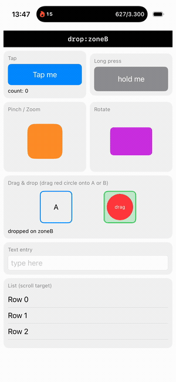

# Testa

[](https://github.com/seizeddev/testa/actions/workflows/ci.yml)
[](LICENSE)


**Autonomous iOS-Simulator E2E testing for AI agents.** Testa lets coding agents
(Claude Code, Codex, Cursor, …) drive a booted iOS Simulator with *real* HID
touches — including complex gestures — and read the screen via the accessibility
tree **or on-device OCR**, so they can test apps end-to-end without you
babysitting the simulator, and **without adding a single `testID`**.

Built for **React Native / Expo and native SwiftUI** apps on **iOS 26**.



- **Works with zero app setup** — you don't need to add `testID`s. Testa reads
  the accessibility tree (which already exposes visible text for SwiftUI and RN
  `Text`/`Pressable`/`TextInput`) **and** falls back to **on-device Apple Vision
  OCR** to tap any visible text — so it drives even canvas/game/webview/vibe-coded
  apps. `testa see` + `testa tapocr "Continue"`.
- **Few tokens** — agents read a compact accessibility snapshot (one line per
  element), not screenshots. `testa find` / `testa assert` / `testa ui diff`
  keep context tiny.
- **Fast** — a warm daemon keeps the simulator connection, the accessibility
  translator, and the HID client hot. A full screen snapshot is **~60 ms**.
- **Every gesture** — tap, long-press, swipe, **drag-and-drop**, **pinch/zoom**,
  **rotate**, multi-touch, unicode text entry (incl. emoji). Real touch events.
- **Full lifecycle** — boot sims, install/launch/terminate apps, list apps/devices,
  open deep links, set permissions, record video. Multiple simulators in parallel.
- **Zero third-party runtime deps** — Testa talks directly to Apple's private
  `CoreSimulator` / `SimulatorKit` / `AccessibilityPlatformTranslation` frameworks
  and uses Apple's Vision + `simctl`. No idb, no Appium, no Maestro.
- **Local & private** — the daemon listens only on a `0600` per-user Unix-domain
  socket under `~/.testa`. No network, no telemetry.

## How it works

```
agent ──► testa (CLI)            ──┐
agent ──► testa mcp (MCP server) ──┤ Unix socket (~/.testa/daemon-<udid>.sock, 0600)
                                   ▼
                              testad (warm daemon)
                                   │  Obj-C engine, dlopen'd private frameworks
                    ┌──────────────┼───────────────┐
                    ▼              ▼                ▼
              SimulatorKit    CoreSimulator   AccessibilityPlatformTranslation
              (Indigo HID)    (SimDevice)     (AXPTranslator → a11y tree)
                    │              │                │
                    └──────────────┴────────────────┘
                          booted iOS Simulator
```

- **HID injection** reimplements the Indigo touch wire-format
  (`SimDeviceLegacyHIDClient`), so taps/drags/multitouch are byte-for-byte what
  the simulator's guest HID service expects.
- **Accessibility** drives `AXPTranslator` with a token delegate that bridges
  each lazy attribute read to an async `SimDevice` XPC request — the same path
  the OS uses — yielding the full element tree with ids, labels, values, and
  frames in **point coordinates that match the tap space**.

## Install

One line — clone and install (builds a release binary into `~/.local/bin/testa`,
installs the Claude Code skill, and registers the MCP server):

```bash
git clone https://github.com/seizeddev/testa && cd testa && ./install.sh
```

Or via Homebrew (builds from source — no tap, no notarized binary needed):

```bash
brew install https://raw.githubusercontent.com/seizeddev/testa/main/Formula/testa.rb
```

Requirements: macOS with Xcode (Xcode 26 / iOS 26 simulators), Swift 6.
A `release.sh` (universal binary; codesigns/notarizes when a Developer ID is
present) is included for prebuilt distribution.

## Use

Boot a simulator and launch your app, then:

```bash
testa boot "iPhone 17 Pro"          # boot a sim (or use an already-booted one)
testa install ./MyApp.app && testa launch com.example.myapp
testa ui                            # compact accessibility snapshot
testa see                           # OCR — every visible text + tap coords
testa tap "Continue"                # by label; falls back to OCR if needed
testa tapocr "Continue"             # force tap-by-visible-text (no a11y)
testa typein "#email" "a@b.co"      # tap field, then type
testa setvalue "#bio" "Grüße 😀"    # set any unicode value directly
testa dragdrop "#card" "#trash"     # drag-and-drop by element
testa pinch "#map" 2.0              # zoom in   ·  testa rotate "#photo" 1.57
testa record start out.mp4 ; testa record stop
testa assert "#status" label=done   # PASS/FAIL (exit 0/1)
```

Selectors are `eN` refs (from `ui`), `#identifier`, `"label"`, or raw `x y`.
Target a specific simulator with `--udid <udid>`. See `testa help`. For agents,
the bundled **skill** documents the loop.

### As an MCP server

`testa mcp` speaks MCP over stdio. Tools: `ui, see, find, tap, tapText, type,
setValue, key, swipe, drag, dragdrop, longpress, pinch, rotate, screenshot,
assert, wait, install, launch, terminate, apps, open, info`. Register it with
`claude mcp add testa -- testa mcp`.

## Showcase / test apps

Two example apps with complex gestures double as Testa's regression suite. Each
mirrors the last recognized gesture into a `#status` element, so gestures are
verified through the accessibility tree alone:

- `examples/native` — SwiftUI. Build & run: `examples/native/build.sh`, then
  `examples/native/e2e.sh` for the gesture regression suite.
- `examples/rnshowcase` — Expo/React Native. See `TESTA_README.md` there.

## Security & multi-user

- Communication is a per-user Unix-domain socket (`~/.testa`, dir `0700`, socket
  `0600`). No TCP, no remote surface.
- The daemon runs as your user and only controls simulators your user can.
- No telemetry; nothing leaves your machine.

## Limitations (honest)

- **Icon-only controls with no text and no accessibility label** are ambiguous to
  any automation — neither the a11y tree nor OCR can name them. Use coordinates,
  or have the app add an `accessibilityLabel`.
- The prebuilt-binary path isn't notarized unless you build it with your own
  Apple Developer ID (`release.sh`). The `git clone` and Homebrew paths build
  from source, so this doesn't apply to them.
- iOS Simulator only (by design). Real devices and Android are out of scope.
- Live FPS video streaming isn't implemented; `testa record` produces H.264 MP4.

## Status

Verified on Xcode 26.4 / iOS 26.4, iPhone 17 Pro. Engine, daemon, CLI, MCP, the
in-process screenshot, Vision OCR (tap-by-visible-text), unicode/emoji entry, app
lifecycle, multi-sim, and video record all work. Both showcases — `examples/native`
(SwiftUI) and `examples/rnshowcase` (Expo/React Native) — pass the full
complex-gesture E2E suite (tap, long-press, pinch, rotate, drag-and-drop, text).
